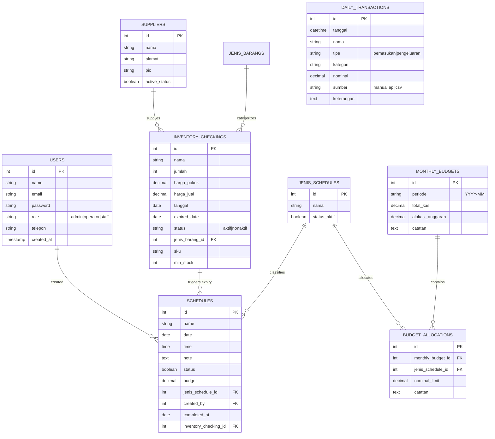

# MSL FinTrack & Scheduler - Database & Controller Reference Manual

This document provides a comprehensive technical overview of the database schema and controller structures in the **MSL FinTrack & Scheduler** application. It serves as a guide for developers working on data migrations, entity relationships, and core business logic.

---

## 🗄️ 1. Database Architecture & Schema

The application utilizes an embedded **SQLite** database (`database/database.sqlite`). The schema is structured with relational constraints, cascading foreign keys, and indexes for query optimization.

---

### Detailed Table Specifications

#### 1. `users` Table
Stores authentication credentials and access control authorizations.
- `id` (INTEGER, Primary Key, Auto-Increment)
- `name` (VARCHAR)
- `email` (VARCHAR, Unique)
- `password` (VARCHAR)
- `role` (VARCHAR) - Allowed values: `admin` (Super Admin), `operator`, `staff`.
- `telepon` (VARCHAR, Nullable) - Contact number.
- `remember_token` (VARCHAR, Nullable)
- `created_at` / `updated_at` (Timestamp)

#### 2. `suppliers` Table
Stores contact information for corporate vendors.
- `id` (INTEGER, Primary Key)
- `nama` (VARCHAR)
- `alamat` (VARCHAR, Nullable) - Supplier physical address.
- `pic` (VARCHAR, Nullable) - Name of the Person in Charge.
- `active_status` (BOOLEAN, Default: `1`) - Toggles whether schedules can be associated with this vendor.
- `created_at` / `updated_at` (Timestamp)

#### 3. `inventory_checkings` Table
Tracks storage items, wholesale values, retail margins, and expiration indicators.
- `id` (INTEGER, Primary Key)
- `sku` (VARCHAR, Unique, Nullable) - Stock Keeping Unit.
- `nama` (VARCHAR)
- `jumlah` (INTEGER) - Available quantity in stock.
- `min_stock` (INTEGER, Default: `10`) - Threshold trigger for low stock warnings.
- `harga_pokok` (DECIMAL, 15, 2) - Purchase wholesale cost.
- `harga_jual` (DECIMAL, 15, 2) - Customer retail price.
- `tanggal` (DATE) - Physical check date.
- `expired_date` (DATE, Nullable) - Product expiration date.
- `status` (VARCHAR, Default: `'aktif'`) - Allowed values: `aktif`, `nonaktif`.
- `jenis_barang_id` (INTEGER, Foreign Key referencing `jenis_barangs.id`)
- `created_at` / `updated_at` (Timestamp)

#### 4. `schedules` Table
Logs business events, restocking dates, and operational tasks.
- `id` (INTEGER, Primary Key)
- `name` (VARCHAR)
- `date` (DATE) - Execution date.
- `time` (TIME) - Execution hour.
- `note` (TEXT, Nullable) - Detailed descriptions.
- `status` (BOOLEAN, Default: `0`) - `0` for pending, `1` for completed.
- `budget` (DECIMAL, 15, 2, Nullable) - Expense ceiling for this event.
- `jenis_schedule_id` (INTEGER, Foreign Key referencing `jenis_schedules.id`)
- `created_by` (INTEGER, Foreign Key referencing `users.id`, Nullable)
- `completed_at` (DATE, Nullable) - Timestamp marked automatically when task `status` flips to `1`.
- `inventory_checking_id` (INTEGER, Foreign Key referencing `inventory_checkings.id`, Nullable) - Linked on product expiration sync (Cascades on delete).
- `created_at` / `updated_at` (Timestamp)

#### 5. `daily_transactions` Table
Logs POS cashier shifts receipts or manual cash box additions.
- `id` (INTEGER, Primary Key)
- `tanggal` (DATETIME)
- `nama` (VARCHAR)
- `tipe` (VARCHAR) - Allowed values: `pemasukan` (income), `pengeluaran` (expense).
- `kategori` (VARCHAR) - Group name matching schedule categories.
- `nominal` (DECIMAL, 15, 2) - Transaction amount.
- `sumber` (VARCHAR) - Origin of input: `manual`, `api`, `csv`.
- `keterangan` (TEXT, Nullable)

#### 6. `monthly_budgets` Table
Sets the monthly financial limits and stores cash pool goals.
- `id` (INTEGER, Primary Key)
- `periode` (VARCHAR, Unique) - Format: `YYYY-MM` (e.g. `2026-06`).
- `total_kas` (DECIMAL, 15, 2) - Base starting cash pool for the month.
- `alokasi_anggaran` (DECIMAL, 15, 2) - Combined ceiling budget allocated for this month.
- `catatan` (TEXT, Nullable)

#### 7. `budget_allocations` Table
Divides monthly budget limits among individual categories.
- `id` (INTEGER, Primary Key)
- `monthly_budget_id` (INTEGER, Foreign Key referencing `monthly_budgets.id`, Cascades on delete)
- `jenis_schedule_id` (INTEGER, Foreign Key referencing `jenis_schedules.id`)
- `nominal_limit` (DECIMAL, 15, 2) - Maximum spending allowed for this category.
- `catatan` (TEXT, Nullable)

---

## 🎮 2. Controller Architectures & Logic

Controllers are housed in `app/Http/Controllers/`. They orchestrate HTTP requests, run queries, and map results to views or API JSON feeds.

### 1. `FinanceController`
Manages the application's budget allocations, financial charts, and CSV/PDF reports.

*   `index(Request $request)`:
    *   **Purpose**: Main financial dashboard.
    *   **Logic**:
        - Extracts `periode` parameter (default: current month `Y-m`).
        - Calculates current month's **Gross Profit** (sum of `harga_jual - harga_pokok` * `jumlah` for active checkings + `daily_transactions` pemasukan).
        - Calculates current month's **Expenses** (sum of `schedules` budget + `daily_transactions` pengeluaran).
        - Calculates **Cumulative Cash Pool** starting from a baseline of Rp1,000,000,000 (`1B + allTimeProfit - allTimeExpense`).
        - Calculates **50/30/20 Budgeting Rule** allocations (`needsExpense` vs `wantsExpense` vs `netMargin` as Savings).
        - Calculates **Health Advisor rating** based on operating expense ratio.
        - Prepares a 6-month historical array for area charts and categorizes pie chart allocations.
        - Compiles **Budget Variance Analysis** (`budgetVariance`) mapping:
          `Batas Anggaran` vs `Belanja Aktual`, `Sisa Dana`, and `Persentase Deviasi`.
    *   **View**: `admin.finance.index`

*   `budgeting(Request $request)`:
    *   **Purpose**: Monthly budget planner page.
    *   **Logic**: Calculates prior-month cumulative cash pool to prepopulate default budget settings. Shows active categories.
    *   **View**: `admin.finance.budgeting`

*   `storeBudget(Request $request)`:
    *   **Purpose**: Stores/saves the monthly budget planner configurations.
    *   **Logic**: DB Transaction structure. Overwrites/deletes older budgets for the same month period before inserting parent and child allocations records. Prevents total allocations from exceeding the month's overall budget ceiling.

*   `getRemainingBudget(Request $request)`:
    *   **Purpose**: API endpoint called via AJAX on scheduling create/edit forms.
    *   **Logic**: Computes remaining allocation limit for a given category and month.
        `Remaining = Limit - (Already Scheduled + Daily Transaction Expenses)`.

*   `exportPdf(Request $request)`:
    *   **Purpose**: Monthly financial performance exporter.
    *   **Logic**: Prepares detailed itemized lists for **Pembelian Barang / Restocking** (active inventory entries), **Operational Costs** (schedules + daily transactions), and **Maintenance Costs** (schedules + daily transactions) along with variance comparisons.
    *   **View**: `admin.finance.pdf_report`

---

### 2. `AdminController`
Prepares primary administrative statistics and charts.

*   `dashboard()`:
    *   **Purpose**: The central Admin control panel dashboard.
    *   **Logic**:
        - Retrieves inventory warning alerts (items expiring in 7 days).
        - Compiles upcoming schedule reminders (schedules in 7 days).
        - Calculates active users counts, supplier numbers, and total schedule events.
        - Calculates financial metrics (Untung Bulanan, Beban Anggaran, Saldo Kas Utama) similar to `FinanceController` using the current date context.
        - Passes 6-month trend arrays and budget distributions to render Chart.js widgets.
    *   **View**: `admin.dashboard`

---

### 3. `ScheduleController`
Manages calendar events, scheduling forms, status toggles, and drag-and-drop actions.

*   `index(Request $request)`:
    *   **Purpose**: Main schedules listing page.
    *   **Logic**: Feeds active database entries and maps them into calendar lists. Prepares budget widgets.
    *   **View**: `admin.Schedule.index`

*   `toggleStatus($id)`:
    *   **Purpose**: Toggle task status between pending (`0`) and completed (`1`).
    *   **Logic**: If marked as completed, sets `completed_at = now()`. If flipped back to pending, resets `completed_at = null`.

*   `updateDate(Request $request, $id)`:
    *   **Purpose**: API Endpoint supporting calendar drag-and-drop.
    *   **Logic**: Receives a `date` parameter via AJAX POST and updates the corresponding schedule's date instantly.

---

### 4. `InventoryCheckingController`
Controls item entries and executes automatic calendar reminders on product expirations.

*   `store(Request $request)`:
    *   **Purpose**: Saves a new item checking entry.
    *   **Logic**: In addition to database insertion, it checks if `expired_date` is present:
        - If present, it triggers the creation of a schedule reminder under the "Kedaluwarsa Barang" category.
        - Task date is set to the product's `expired_date`, and execution date is set to **30 days prior**.

*   `update(Request $request, $id)`:
    *   **Purpose**: Modifies product specs.
    *   **Logic**: Synchronizes corresponding calendar schedules when product names or expiration dates change.

*   `destroy($id)`:
    *   **Purpose**: Deletes inventory entry.
    *   **Logic**: Cascades deletion to remove the associated expiry schedule reminder from the database automatically.
